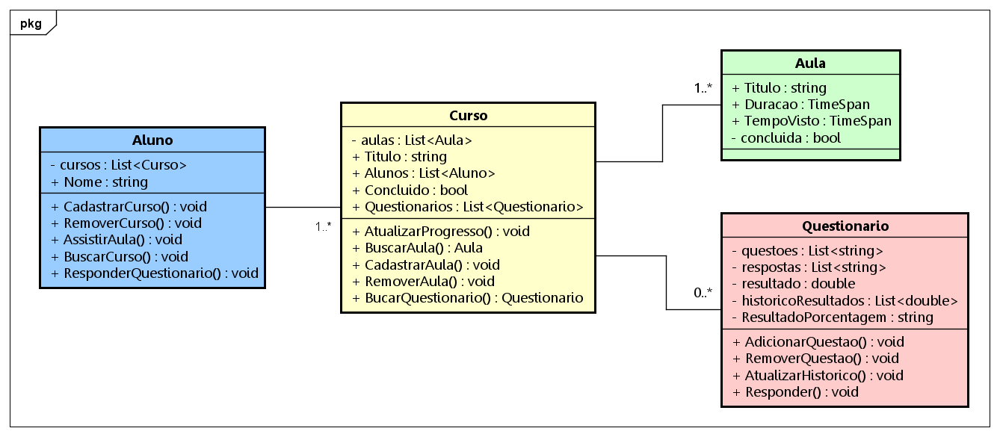
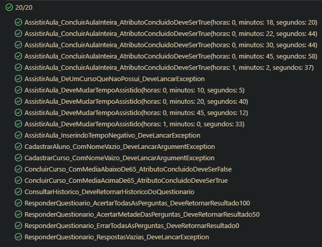

# DIO - Trilha .NET - Blindando Seu Código com TDD e Testes Unitários Usando .NET Core

Projeto para a conclusão do módulo de Desenvolvimento Orientado a Testes do curso ".NET Developer" da DIO.
Nesse desafio, foi proposto um projeto livre que deveria ter o mínimo de 80% de cobertura de testes.
 

## Sobre o projeto

O sistema possui dois projeto básicos separados, um em console e outro em XUnit. O console simula o acompanhamento das aulas de um curso online, contendo as classes Aluno, Curso, Aula e Questionario. O fluxo geral envolve as ações de cadastrar os cursos no perfil do aluno, registrar o tempo de aula assistido e responder os questionários dentro de cada curso.
 

### Diagrama de classes

### Escopo e funcionamento do sistema
- Todo **aluno** possui uma lista de cursos, podendo assitir apenas as aulas contidas aos que tem acesso;
- Toda vez que uma **aula** é assistida, seu tempo de visualização é contabilizado e comparado com a duração total da aula. Caso o aluno já tenha assistido 90% do tempo, a aula é dada como concluída;
- Cada aula possui um mínimo de 5 minutos de duração;
- Cada **curso** possui um nome único e uma quantidade indefinida de aulas e questionários;
- Cada **questionário** possui um lista de perguntas e outra de respostas, que correspondem a cada pergunta. Depois que o aluno registra suas respostas, seu resultado final será dado por meio de porcentagem;
- Os questionários podem ser refeitos mais de uma vez, e todos os resultados são salvos em um histórico. A última tentativa será a que ficará como resultado atual;
- Para **concluir** um curso, o aluno deverá ter todas as aulas concluídas e a média dos seus resultados atuais dos questionários deverá ser a partir de 65%.

### Classe de Testes (`DesafioTDDTests`)

| Método | Descrição |
| ------ | --------- |
| CadastrarAluno_ComNomeVazio_DeveLancarArgumentException                 | O sistema deverá enviar um alerta após a tentiva de cadastro de um usuário com nome vazio.
| CadastrarCurso_ComNomeVaizo_DeveLancarArgumentException                 | O sistema deverá enviar um alerta após a tentiva de cadastro de um curso com título vazio.
| ResponderQuestioario_AcertarTodasAsPerguntas_DeveRetornarResultado100   | Ao acertar todas a perguntas de um questionário, o resultado computado do sistema deverá ser de 100%.
| ResponderQuestionario_AcertarMetadeDasPerguntas_DeveRetornarResultado50 | Ao responder 2 perguntas corretamente um questionário com o total de 4, o resultado computado do sistema deverá ser de 50%.
| ResponderQuestionario_ErrarTodasAsPerguntas_DeveRetornarResultado0      | Ao errar todas as perguntas de um questionário, o resultado computado do sistema deverá ser de 0%.
| ResponderQuestionario_RespostasVazias_DeveLancarException               | Ao receber um uma lista com número de respostas menor do que a quantidade de perguntas registradas, o sistema deverá enviar um alerta.
| AssistirAula_DeveMudarTempoAssistido                                    | Verifica se função `AssistirAula()` na classe `Aluno` está funcionando corretamente e atualizando o progresso da aula.
| AssistirAula_InserindoTempoNegativo_DeveLancarException                 | Caso o tempo de aula inserido estiver com valor negativo, o sistema enviará um alerta e não atualizará o tempo de visualização da aula.
| AssistirAula_DeUmCursoQueNaoPossui_DeveLancarException                  | Ao tentar assistir uma aula, o sistema verificará se o usuário tem permissão para ver o conteúdo, ou seja, se possui o curso relacionado cadastrado em seu perfil.
| AssistirAula_ConcluirAulaInteira_AtributoConcluidoDeveSerTrue           | Verifica se o atributo `_concluida_` na classe `Aula` é atualizado após o aluno passar da marca de 90% do tempo assistido.
| ConsultarHistorico_DeveRetornarHistoricoDoQuestionario                  | Verifica se o histórico emitido pelo sistema está sendo gerado com os mesmos valores e ordem das tentativas do aluno.
| ConcluirCurso_ComMediaAcimaDe65_AtributoConcluidoDeveSerTrue            | Verifica se o curso foi concluído após todas aulas serem assistidas e com 100% de acerto nos testes. Nesse caso, o resultado deverá ser positivo.
| ConcluirCurso_ComMediaAbaixoDe65_AtributoConcluidoDeveSerFalse          | Verifica se o curso foi concluído após todas aulas serem assistidas e com 0% de acerto nos testes. Nesse caso, o resultado deverá ser negativo.

### Outline da Classe

>
